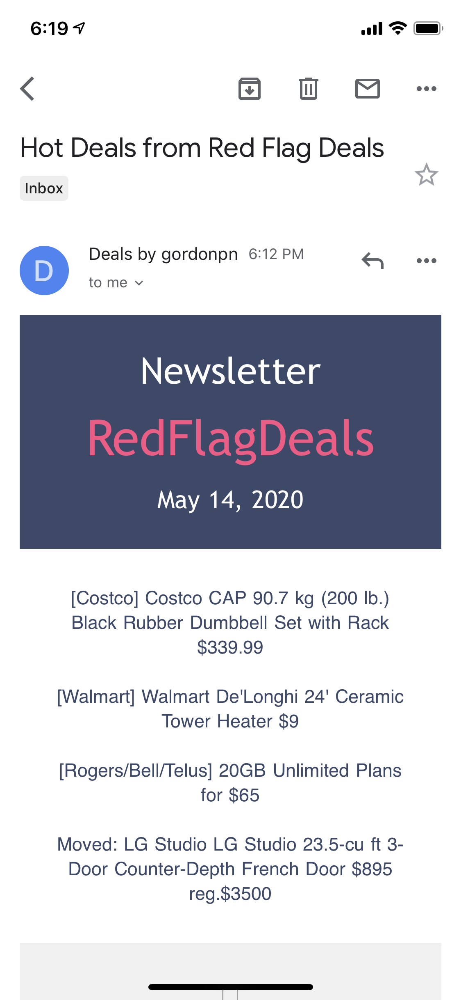

# Hot Deals

## Description

Software as a service scraping the [Hot Deals forums](https://forums.redflagdeals.com/hot-deals-f9/) and delivering newsletter emails on trending deals from the Forum.

---

## Objective / Motivation

Red Flag Deals does aggregate deals on their front page, **but** the Hot Deals Forums are community driven and crowdsourced. This is where the purpose of my project comes into play, this project scrapes the Hot Deals Forums several times per day.

Red Flag Deals does aggregate deals on their front page, but the Hot Deals Forums are community driven and sourced by anybody. This is where the purpose of my project comes into play, this project scrapes the Hot Deals Forums several times per day.

## Screenshot

Base template design by [@tiffzeng](https://github.com/tiffzeng)

## Built with / technologies

* Go programming language
* SendGrid
* Docker
* PostgreSQL
* Drone CI

## Features

* Automated scraping of the Forum
* Insert and update a database
* Automated newsletter email
* Algorithm to filter the junk

## Getting started

### Prerequisites

* Go(lang) v1.14+
* Docker-compose v1.25.5+
* Docker v19.03+

### Configuration

| Variable                  | Description                                                                                                |
|---------------------------|------------------------------------------------------------------------------------------------------------|
| SENDGRID_API_KEY          | SendGrid API key to use the service                                                                        |
| SENDGRID_TEMPLATE         | SendGrid requires you to upload an html template to use for dynamic emails, this is the ID of the template |
| POSTGRES_NONROOT_DB       | Database for the appuser                                                                                   |
| POSTGRES_DB               | Root database                                                                                              |
| POSTGRES_USER             | Root username to initialize PostgreSQL                                                                     |
| POSTGRES_PASSWORD         | Root password to initialize PostgreSQL                                                                     |
| POSTGRES_NONROOT_PASSWORD | The user password to use the database, we don't want to use the root user for these tasks                  |
| POSTGRES_NONROOT_USER     | The user username to use the database                                                                      |
| DEV                       | Set this variable to anything to run as dev (testing purposes)                                             |
| SCRAPER_HC_UUID           | UUID for Healthchecks.io                                                                                   |
| MAILER_HC_UUID            | UUID for Healthchecks.io                                                                                   |

### Installing

Build individual Go services into a binary

`go build -o main .`

### Usage

Bring the services up using docker-compose.

## Running the tests

`go test`

## Roadmap / Todo

Check out the [open issues](https://github.com/gordonpn/hot-flag-deals/issues?q=is%3Aissue+is%3Aopen+sort%3Aupdated-desc) for ideas and features I have planned!

## Support

You may open an issue for discussion.

## Authors

* Myself [@gordonpn](https://github.com/gordonpn)

## License

[MIT License](./LICENSE)
